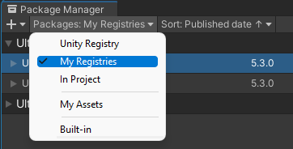
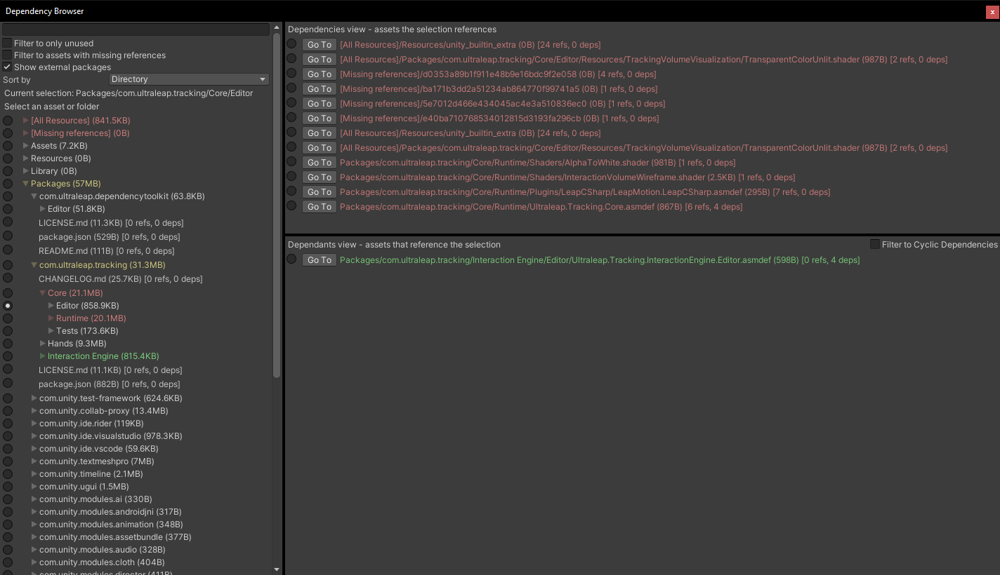

# Unity Dependency Toolkit

Tools for discovering, navigating and analysing asset dependencies.

## Installing

1. In `Edit -> Project Settings -> Package Manager`, add a new scoped registry with the following details. Scoped registry setup only needs to be performed once per Unity project.

```
Name: Ultraleap
URL: https://package.openupm.com
Scope(s): com.ultraleap
```

2. Open the Package Manager (`Window -> Package Manager`) and navigate to "My Registries" in the dropdown at the top left of the window.



3. The `Ultraleap Dependency Toolkit` package (and other Ultraleap packages) will now be available from the list to install, update or remove.

## Dependency Browser



### Features

1. Discover dependencies and references to an individual asset or folder
2. Filtering for unused (0 reference) assets
3. Filtering for missing references along with list of references to a specific missing asset
4. Aggregate and navigate resource folders from all packages
5. Displays file sizes with option to sort by size
6. Supports both packages and the assets directory

### Limitations

1. Script dependency resolution is limited
   1. Does not find script asset dependencies - they can be viewed through containing .asmdef
   2. No support for dependencies/references between individual script files e.g. class references and such
2. Will not discover assets in hidden folders e.g. Samples~ in packages.
3. Missing references detection has some caveats
   1. Does not display number of references missing on a specific asset
   2. May pick up dead guids from an asset file that don't show in the inspector, indicating a non-issue
4. Will duplicate references everywhere that an asset has been copied by Unity, e.g. in scene or prefab files
   1. For example if asset A references prefab B which in turn references prefab C, asset A will show as referencing prefab C

### Usage

1. `Assets -> Generate Dependency Tree` or right click context menu `Generate Dependency Tree`.
2. This will create a `Dependency Tree` asset in the root Assets folder. You can move this anywhere - note that using Generate again will create another asset if it has been moved.
3. On the inspector of `Dependency Tree`, use the `Refresh` button to scan the project. Use this any time the project has changed to update.
4. Use `Open Dependency Browser` open and look through the results.


### Known Issues

- Dependency browser may break if it's open during recompilation. Reload the window to fix.
- Refresh may break the dependency browser if it's open. Reload the window to fix.
